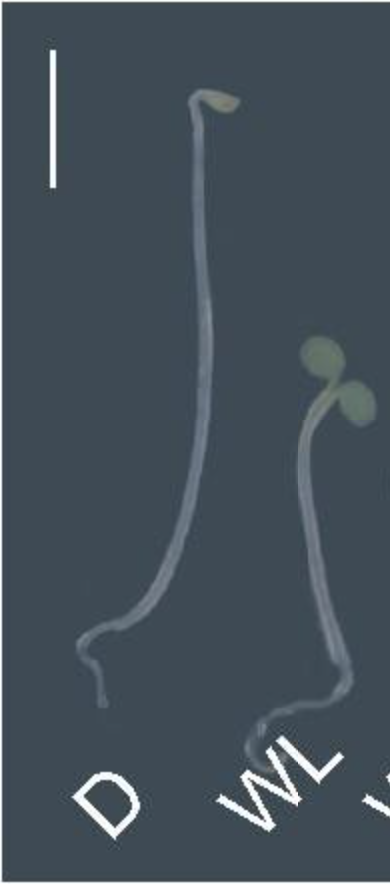
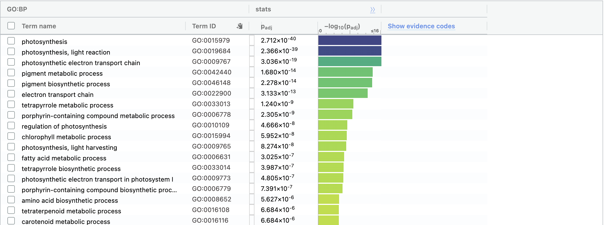
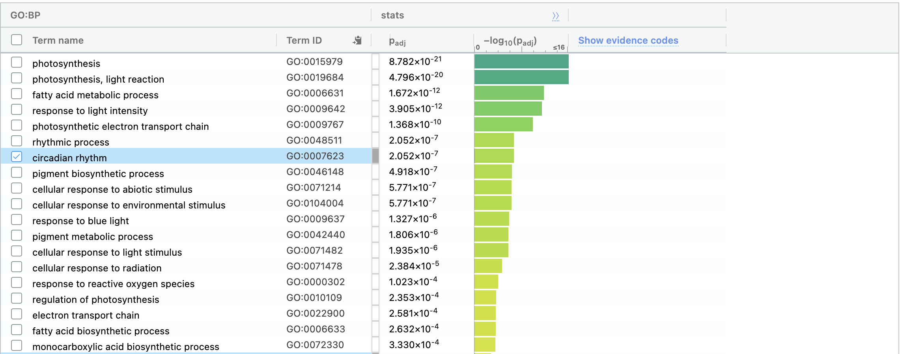
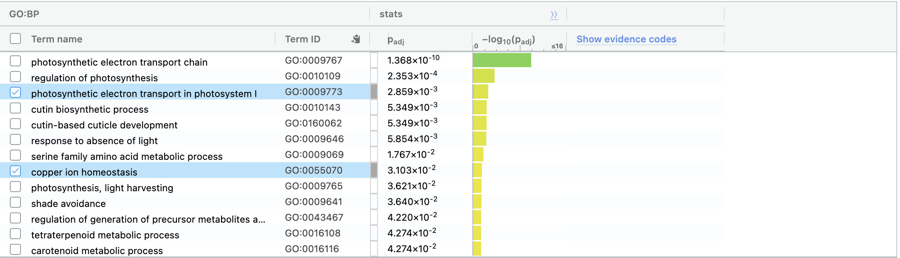

```{r, message=FALSE, warning=FALSE}
if (!requireNamespace("BiocManager"))
    install.packages("BiocManager", quietly=TRUE)

if (!requireNamespace("Biobase"))
    BiocManager::install("Biobase", quietly=TRUE)

if (!requireNamespace("edgeR"))
    install.packages("edgeR", quietly=TRUE)

if (!requireNamespace("ComplexHeatmap"))
    BiocManager::install("ComplexHeatmap", quietly=TRUE)

if (!requireNamespace("circlize"))
    install.packages("circlize", quietly=TRUE)

if (!requireNamespace("ggplot2"))
    install.packages("ggplot2", quietly=TRUE)

if (!requireNamespace("limma"))
    BiocManager::install("limma", quietly=TRUE)

if (!requireNamespace("magick"))
    BiocManager::install("magick", quietly=TRUE)

if (!requireNamespace("org.At.tair.db"))
  BiocManager::install("org.At.tair.db", quietly=TRUE)

library("knitr")


```

# Assignment 2

```{r}
getwd()
# Fetch data from previous assignment
norm_cpms <- read.table(file=paste(c(dirname(getwd()), "/normalized_cpms.csv"), collapse =''),
                        header = TRUE,sep = ",",
                        stringsAsFactors = FALSE,
                        check.names=FALSE)
samples <- read.table(file=paste(c(dirname(getwd()), "/samples.csv"), collapse =''),
                      header = TRUE,sep = ",",
                      stringsAsFactors = FALSE,
                      check.names=FALSE)
```


## Creating a heatmap

```{r, fig.cap='Fig 1. Heatmap displaying each of the given samples in the dataset.'}


# Convert our normalized cpms into matrix visulisable on heatmap.
heatmap_matrix <- norm_cpms[,3:ncol(norm_cpms)]
colnames(heatmap_matrix) <- colnames(norm_cpms[,3:ncol(norm_cpms)])

# Scale heatmap with row normalisation
heatmap_matrix <- t(scale(t(heatmap_matrix)))

# Select colour scheme - add additional colour if negative values present.
if(min(heatmap_matrix) == 0){
    heatmap_col = circlize::colorRamp2(c( 0, max(heatmap_matrix)), 
                             c( "white", "red"))
  } else {
    heatmap_col = circlize::colorRamp2(c(min(heatmap_matrix), 0, 
          max(heatmap_matrix)), c("blue", "white", "red"))
  }


current_heatmap <- ComplexHeatmap::Heatmap(as.matrix(heatmap_matrix),
      show_row_dend = FALSE, show_column_dend = TRUE, 
      col=heatmap_col,show_column_names = TRUE, 
      show_row_names = FALSE,show_heatmap_legend = TRUE, use_raster=TRUE)

# current_heatmap

```

Let's take a look at our MDS plot to justify our model.
```{r, fig.cap=" Fig 2. MDS plot for each of our given samples, coloured by condition."}
# Creating a MDS plot for our samples.
cls <- rainbow(ncol(heatmap_matrix))[factor(samples$Group)]
limma::plotMDS(heatmap_matrix, col = cls)
```

It appears that replicates tend to cluster together quite well. This supports our idea that we should group our samples by replicates.

## Differential Gene Expression

### Question 1

```{r}

get_de_lm <- function(norm_data, sample_groups){
  # Use linear models from limma package to identify differentially expressed genes.
  
  # norm_data <- norm_cpms
  # sample_groups <- samples
  
  # Define our model.
  model_design <- model.matrix(~ sample_groups$Group)
  
  # Format expression data before fitting.
  expressionMatrix <- as.matrix(norm_data[,3:length(norm_data)])
  rownames(expressionMatrix) <- norm_data$ID
  colnames(expressionMatrix) <- colnames(norm_data)[3:length(norm_data)]
  minimalSet <- Biobase::ExpressionSet(assayData=expressionMatrix)
  
  # Generate linear model.
  fit <- limma::lmFit(minimalSet, model_design)
  
  # Apply eBayes to compute probability of observing given data given the null.
  fit2 <- limma::eBayes(fit,trend=TRUE)
  
  # Convert to 
  topfit <- limma::topTable(fit2, 
                     coef=ncol(model_design),
                     adjust.method = "BH",
                     number = nrow(expressionMatrix))
  
  
  # Format results; sort by pvalue.
  output_hits <- merge(norm_data[,1:2],
                       topfit,
                       by.y=0,by.x=1,
                       all.y=TRUE)
  
  return(output_hits)
}

# Let's just look at the difference between light and dark conditions in the wild type.
norm_cpms <- cbind(norm_cpms[, 1:2], norm_cpms[grep('WT', names(norm_cpms))])
samples <- samples[grep('WT', samples$Group),]

# What is significantly differential expressed between all of the groups?
output_hits <- get_de_lm(norm_cpms, samples)

output_hits <- output_hits[order(output_hits$adj.P.Val),]
knitr::kable(output_hits[1:10,2:8],type="html",row.names = FALSE, digits=32,
             caption="Table 1. Genes ranked by their significace values (L-G) after adjusting for multiple hypothesis testing. Name: Gene name, logFC: log10 of the fold change between dark to light. AveExpr: average expression level in normalised dataset. t: score of t value as calculated by students t-test. P.Value: significance of differential expression given the model. adj.P.Val: significance of differential expression after adjusting for multiple hypothesis testing.")

sig_threshold <- 0.05

```

Among our `r nrow(output_hits)` genes, `r sum(output_hits$P.Value < sig_threshold)` are over our threshold value of `r sig_threshold`. We have chosen this value as it is commonly used as a good indicator of significance by scientists, though is still ocmpletely arbitrary. As such, we accept that (given our assumptions) there is a `r sig_threshold * 100`% chance that a significant sample occurs by random chance. Since we are repeating this process for `r nrow(output_hits)` genes, we might expect roughly `r nrow(output_hits) * sig_threshold` significant results to occur by random chance. We'll try and lower this a bit using multiple hypothesis testing.

## Question 2

We're using the Benjamini and Hochberg method, which takes adjust the p value as a function of the p-value rank of each entry. This method is not as powerful as modern approaches, which offer modest increases in power but is sufficient to increase our confidence that our DE genes are not simply noise [@mht]. `r sum(output_hits$adj.P.Val < sig_threshold)` genes overcome the threshold after adjustment by the BH method. There is very clearly differential expression happening, as demonstrated by the high level of statistical power we've managed to acheive.

## Question 3

Let's visualize our results in a volcano plot. Since we have such a huge number of differentially expressed genes, let's focus only on the ones that also have a significant fold change.

```{r, fig.cap=paste(c("Fig 3. Volcano plot of adjusted p-values against fold change. Significantly differentially expressed genes (p < ", as.character(sig_threshold),") with absolute log fold change > ", as.character(fold_change_threshold), " are designated as UP if their log fold change is positive, and DOWN if their log fold change is negative. All others are designated as NO." ), collapse ='')}
library(ggplot2)
# Volcano plot. Code modified from https://biocorecrg.github.io/CRG_RIntroduction/volcano-plots.html

fold_change_threshold <- 2500

# Which genes are significantly differentially expressed and have high abs fold change?
output_hits$diffexpressed <- "NO"
output_hits$diffexpressed[output_hits$logFC > fold_change_threshold & output_hits$adj.P.Val < sig_threshold] <- "UP"

output_hits$diffexpressed[output_hits$logFC < -fold_change_threshold & output_hits$adj.P.Val < sig_threshold] <- "DOWN"

num_most_interesting <- 4

#  Include <num_most_interesting> most "outlying" genes names in the graph.
output_hits$delabel <- NA
output_hits$fac <- abs(as.numeric(output_hits$logFC)) * - log10(as.numeric(output_hits$adj.P.Val))
outlier_rank <- order(output_hits$fac, decreasing = TRUE)
most_interesting <- outlier_rank[1:num_most_interesting]
output_hits$delabel[most_interesting] <- output_hits$NAME[most_interesting]


# Re-plot but this time color the points with "diffexpressed"
p <- ggplot(data=output_hits, aes(x=logFC, y=-log10(adj.P.Val), col=diffexpressed, label=delabel)) + 
  geom_point() + 
  geom_vline(xintercept=c(-fold_change_threshold, fold_change_threshold), col="red") +
  geom_hline(yintercept=-log10(sig_threshold), col="red") +
  geom_text() +
  labs(title="Identifying Key DE Genes Through Significance and Magnitude of DE")

ranks <- output_hits$adj.P.Val * sign(output_hits$logFC)
rank_list <- data.frame(name=output_hits$ID, rank=ranks)
rank_list <- rank_list[order(ranks, decreasing=TRUE),]
write.table(rank_list, paste(c(dirname(getwd()), "/locus_rank_list.rnk"), collapse =''), sep="\t", row.names = FALSE)
```
It looks like we have a huge number of significantly differentially expressed genes. This is likely due to the fact that light deprivation greatly effects the ratio of cotyledon to hypocotyl cells, and thus RNAs that are DE in either organ are also going to be greatly differential expressed.
```{r, echo=FALSE, out.width="30%", fig.cap="Fig 4. D: A seedling grown for two days in light conditions, then one day in dark conditions. WL: A seedling grown for three days in light conditions. Note the difference between the ratios of the hypocotyl (stem) to coltyledons (leaves) inn the different conditions.[@ppm]"}

```
RCA: Rubisco activase, nuclear encoded chloroplast protein. Required for light activation of rubsico. High expression level in cotyledons, some expression in hypocotyl. https://www.arabidopsis.org/servlets/TairObject?type=locus&name=At2g39730

RBCS1A: Encodes a member of the Rubisco small subunit family. Preferentially expressed in cotyledons. https://www.arabidopsis.org/servlets/TairObject?name=At1g67090&type=locus

CAB4: Encodes a chlorophyll a/b-binding protein. Preferentially expressed in hypocotyl and cotyledons. https://www.arabidopsis.org/servlets/TairObject?type=locus&name=At3g47470

LHCB3: Lhcb3 protein is a component of the main light harvesting chlorophyll a/b-protein complex of Photosystem II (LHC II). https://www.arabidopsis.org/servlets/TairObject?name=At5g54270&type=locus

All of the above proteins are required for photosynthesis. It makes sense that these would be up regulated in light conditions.

## Question 4

```{r, fig.cap='Fig 5. Relative expression levels election of 4 significantly differentially expressed genes with high fold changes.'}
most_interesting_loci <- output_hits$ID[most_interesting]
mi_inds <- match(most_interesting_loci, norm_cpms$ID)

# Convert our normalized cpms into matrix visulisable on heatmap.
heatmap_matrix <- norm_cpms[mi_inds,3:ncol(norm_cpms)]
colnames(heatmap_matrix) <- colnames(norm_cpms[mi_inds,3:ncol(norm_cpms)])
rownames(heatmap_matrix) <- norm_cpms[mi_inds, 2]

# Scale heatmap with row normalisation
heatmap_matrix <- t(scale(t(heatmap_matrix)))

# which(is.nan(as.matrix(norm_cpms[,3:length(norm_cpms)])))
# which(is.nan(heatmap_matrix))

nans <- which(is.nan(heatmap_matrix[,1]))
heatmap_matrix[nans, ] <- 0

# Select colour scheme - add additional colour if negative values present.
if(min(heatmap_matrix) == 0){
    heatmap_col = circlize::colorRamp2(c( 0, max(heatmap_matrix)), 
                             c( "white", "red"))
  } else {
    heatmap_col = circlize::colorRamp2(c(min(heatmap_matrix), 0, 
          max(heatmap_matrix)), c("blue", "white", "red"))
  }


current_heatmap <- ComplexHeatmap::Heatmap(as.matrix(heatmap_matrix),
      show_row_dend = FALSE, show_column_dend = TRUE, 
      col=heatmap_col,show_column_names = TRUE, 
      show_heatmap_legend = TRUE, use_raster=TRUE)

current_heatmap
```
As was visible in the volcano plot, these genes are significantly up-regulated in the light condition. The conditions we've selected also cluster together extremely well, which makes sense given that these genes were selected on the basis of their significant differential expression between the two conditions.


# Pathway Enrichment Analysis

## Formatting

```{r}

# Order genes by significance and directionality of change to create thresholded list.
thr_df <- data.frame(id=output_hits$ID, name=output_hits$NAME, 
                     p_val=output_hits$adj.P.Val, 
                     log_fold_change=output_hits$logFC)
thr_df$sig_rank <- -log2(thr_df$p_val) * sign(thr_df$log_fold_change)
thr_df <- thr_df[order(thr_df$sig_rank),]

# Extract up and down regulated genes.
threshold <- 0.01

up_reg <- thr_df$p_val < threshold & thr_df$log_fold_change > 0
sum(up_reg)
down_reg <- thr_df$p_val < threshold & thr_df$log_fold_change < 0
sum(down_reg)

write.csv(thr_df[up_reg,], paste(c(getwd(), '/up_regulated.csv'), collapse = ''))
write.csv(thr_df[down_reg,], paste(c(getwd(), '/down_regulated.csv'), collapse = ''))
write.csv(thr_df[(down_reg | up_reg),], paste(c(getwd(), '/all_de.csv'), collapse = ''))
write.csv(thr_df[down_reg,], paste(c(getwd(), '/ranked.csv'), collapse = ''))

```

## Results

### [Enriched terms for down regulated genes](#https://biit.cs.ut.ee/gplink/l/iwBAOiBkSS):
```{r, echo=FALSE, out.width="70%", fig.cap="GO terms significantly enriched among the down regulated genes. Max term size = 50. Four GO terms were significantly (p=0.05) enriched. Analysis performed by g:GOSt [@gprofiler]."}

```

### [Most significantly enriched terms for up regulated genes](#https://biit.cs.ut.ee/gplink/l/jCyJji5TSt):
```{r, echo=FALSE, out.width="70%", fig.cap="GO terms significantly enriched among the down regulated genes. Max term size = 200. 68 GO terms were significantly (p=0.05) enriched. Analysis performed by g:GOSt [@gprofiler]."}

```

### [Most significantly enriched terms for all differentially regulated genes](#https://biit.cs.ut.ee/gplink/l/yLAsymYFTQ):
```{r, echo=FALSE, out.width="70%", fig.cap="GO terms significantly enriched among the down regulated genes. (top) Max term size = 200 (bottom) Max term size = 50. 13 and 53 GO terms were significantly (p=0.05) enriched for each term size threshold respectively. Analysis performed by g:GOSt [@gprofiler]."}


```

## Question 1

I've chosen to use g:GOSt tool from g:Profiler. This tool is extremely easy to use, and allows for a moderate level of run customization. We are given several multiple hypothesis correction technique, a customizable p value threshold, and allows easy selection of gene sets by size. For Arabidopsis thaliana, the datasets versions used are as follows:

athaliana (Arabidopsis thaliana) - version: TAIR10 

GO:MF – annotations: BioMart 
classes: releases/2022-12-04  
GO:CC – annotations: BioMart 
classes: releases/2022-12-04 
GO:BP – annotations: BioMart 
classes: releases/2022-12-04 
KEGG – KEGG FTP Release 2022-12-26 
REAC – annotations: BioMart 
classes: 2022-12-28 
WP – 20221210 
TF – annotations: TRANSFAC Release 2022.2 
classes: v2 
MIRNA – Release 9.0 
HPA – annotations: HPA website: 22-12-02 
classes: script: 22-12-20 
CORUM – 28.11.2022 Corum 4.1 
HP – annotations: 12.2022 
classes: None 

 All of which have been updated within the last year.
 
## Question 2

I've the GO biological process data set to gain insight into what cellular processes are effected by light deprivation.

## Question 3

See results.


## Question 4

The up-regulated and down-regulated gene sets seem to be enriched for similar terms when combined, but the p-values for these terms are far lower. This is likely due to the noise introduced by mixing the the two - it seems unlikely that the organism would both up and down regulate RNAs involved in the same pathways as a result of a single treatment.


# Interpretation

## Question 1

These analyses have identified the some of the known photomorphogenic effects of light deprivation, including the down regulation of photosynthetic genes and the up regulation of genes responsible for response to the abscence of light. Intuitively, there is no benefit in expressing genes meant to harvest energy from light if light is absent. The authours of the original paper were primarily concerned with de-convoluting the organ specific signals when performing analysis on whole seedlings, however, since their analysis involved several datasets in order to reach their conclusions, I was not able to replicate their findings here. However, the results from this analysis are well in line with the current understanding of plant photomorphogenesis [@photomorph]. Unfortunately, no enrichment for growth regulatory proteins were found, which may be a result of the differential regulation of these processes in the hypocotyl and cotyledons.

## Question 2

The lower relative expression levels of mRNAs observed in light deprived seedlings is eminently explicable given the current understanding of photomorphogenesis. Light deprivation increases hypocotyl growth and inhibits cotyleton growth [@photomorph], given that photosynthetic proteins are primarialy expressed in the cotlyedons [@regionalexp], it would make sense that mRNAs annotated as being involved in photosysnthesis would have lower expression levels. Light expression is also required for plastid differentiation, which results in expression of photosynthetic proteins found in the choloroplast [@chloro].


# References

  Carlson M. (2022). Org.at.tair.db: Genome wide annotation for arabidopsis.
  Chen Y., Lun A.A.T. & Smyth G.K. (2016). From reads to genes to pathways: Differential expression analysis of RNA-seq experiments using rsubread and the edgeR quasi-likelihood pipeline. F1000Research 5: 1438. https://doi.org/10.12688/f1000research.8987.2.
  Gu Z. (2022). Complex heatmap visualization. iMeta.
  Gu Z., Eils R. & Schlesner M. (2016). Complex heatmaps reveal patterns and correlations in multidimensional genomic data. Bioinformatics.
  Gu Z., Gu L., Eils R., Schlesner M. & Brors B. (2014). Circlize implements and enhances circular visualization in r. Bioinformatics 30: 2811–2812.
  Huber W., Carey V.J., Gentleman R., Anders S., Carlson M., Carvalho B.S., Bravo H.C., Davis S., Gatto L., Girke T.,     Gottardo R., Hahne F., Hansen K.D., Irizarry R.A., Lawrence M., Love M.I., MacDonald J., Obenchain V., Ole’s A.K., Pag‘es H., Reyes A., Shannon P., Smyth G.K., Tenenbaum D., Waldron L. & Morgan M. (2015). Orchestrating high-throughput genomic analysis with Bioconductor. Nature Methods 12 (2): 115–121. http://www.nature.com/nmeth/journal/v12/n2/full/nmeth.3252.html.
  McCarthy D.J., Chen Y. & Smyth G.K. (2012). Differential expression analysis of multifactor RNA-seq experiments with respect to biological variation. Nucleic Acids Research 40 (10): 4288–4297. https://doi.org/10.1093/nar/gks042.
  Morgan M. (2023). BiocManager: Access the bioconductor project package repository. https://CRAN.R-project.org/package=BiocManager.
Ooms J. (2023). Magick: Advanced graphics and image-processing in r. https://CRAN.R-project.org/package=magick.
Raudvere U., Kolberg L., Kuzmin I., Arak T., Adler P., Peterson H. & Vilo J. (2019). G: Profiler: A web server for functional enrichment analysis and conversions of gene lists (2019 update). Nucleic acids research 47 (W1): W191–W198.
    Ritchie M.E., Phipson B., Wu D., Hu Y., Law C.W., Shi W. & Smyth G.K. (2015). limma powers differential expression analyses for RNA-sequencing and microarray studies. Nucleic Acids Research 43 (7): e47. https://doi.org/10.1093/nar/gkv007.
    Robinson M.D., McCarthy D.J. & Smyth G.K. (2010). edgeR: A bioconductor package for differential expression analysis of digital gene expression data. Bioinformatics 26 (1): 139–140. https://doi.org/10.1093/bioinformatics/btp616.
    Wickham H. (2016). ggplot2: Elegant graphics for data analysis. Springer-Verlag New York. https://ggplot2.tidyverse.org.


